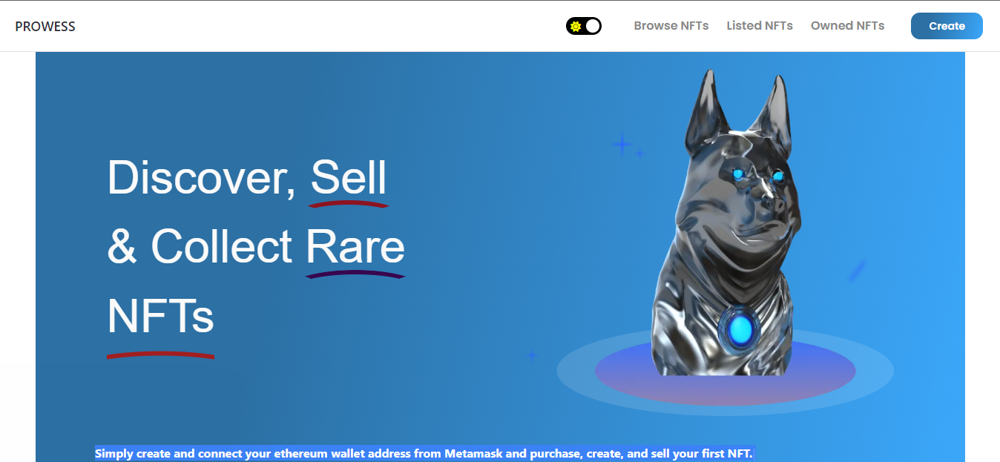

## Welcome to PROWESS NFT Marketplace




PROWESS is a marketplace for Non-Fungible Tokens (NFTs) that combines futuristic elements of Web3 blockchain development and the popular culture wave of non-fungible tokens (NFT), which are a type of digital asset that represent ownership of a unique item or piece of content, such as artwork, collectibles, and more. Unlike traditional cryptocurrencies, NFTs cannot be replaced or exchanged for an identical item, making them truly one-of-a-kind.

With PROWESS, creating, buying, and selling NFTs is simple and efficient. Our platform allows artists, creators, and collectors to easily mint their own NFTs and showcase them to a global audience. Users can browse and purchase NFTs from a variety of creators and categories, and even manage and track their own NFT collection.

One of the key features of PROWESS is the ability for creators to set their own price for their NFTs, giving them more control and autonomy over the value of their work. Additionally, our platform integrates with popular blockchain wallet, MetaMask and allowing for seamless and secure transactions.

The technologies behind PROWESS include the use of blockchain, specifically Ethereum, to mint and track NFTs, as well as a web3 javascript library to interact with the blockchain. The frontend of the platform is built using React, and the backend utilizes a decentralized storage facility - Infura IPFS

To run this project locally, you will need to have a local development environment set up with NodeJS and npm installed. You will also need to set up a local Ethereum blockchain using Hardhat, and connect it to the frontend using a web3 provider.

Once your development environment is set up, you can clone the project repository and run the following commands:


## Getting Started

## Copy code

```bash 
npm install
npm start

```
## OR 

```bash
npm run dev
# or
yarn dev
```

This will start the development server and you can access the platform on http://localhost:3000 with your browser to see the result.


Whether you are an artist looking to monetize your work, a collector searching for unique and rare items, or simply curious about the world of NFTs, PROWESS is the perfect platform for you. Join us today and discover the future of digital ownership.


## Check the live Demo at:
```bash
https://nftdapp-cgo7ok7mv-soloexcel.vercel.app/
```


